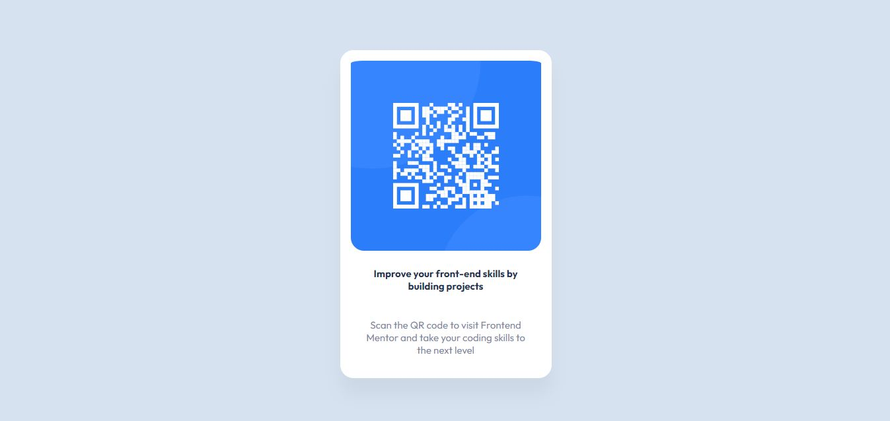

# Frontend Mentor - QR code component solution

This is a solution to the [QR code component challenge on Frontend Mentor](https://www.frontendmentor.io/challenges/qr-code-component-iux_sIO_H). Frontend Mentor challenges help you improve your coding skills by building realistic projects. 

## Table of contents

- [Overview](#overview)
  - [Screenshot](#screenshot)
  - [Links](#links)
- [My process](#my-process)
  - [Built with](#built-with)
  - [What I learned](#what-i-learned)
  - [Continued development](#continued-development)
  - [Useful resources](#useful-resources)
- [Author](#author)

**Note: Delete this note and update the table of contents based on what sections you keep.**

## Overview

### Screenshot



### Links

- Solution URL: [https://github.com/EmmanuelIdeho/QRcodecomponent](https://github.com/EmmanuelIdeho/QRcodecomponent)
- Live Site URL: [https://myqr.netlify.app](https://myqr.netlify.app)

## My process

### Built with

- Semantic HTML5 markup
- Flexbox
- Mobile-first workflow

### What I learned

I learned to use HSL(Hue, Saturation, Lightness) values for the first time. For colors, I would usually just use RGB or the Hex code. Also first time using figma to implement a design; a very useful tool that I will be happily taking advantage of in future projects.

```css
html {
    background-color: hsl(212, 45%, 89%)
}
```
I think I understand the margin a lot better now. Used percentage value to make the the card is somewhat in the middle of the page. In the past, trying to do this would mess with how the color of the website appears when the browser has a Dork Mode extension installed.
```css
.card {
    margin: 10% auto
}
```
### Continued development

I still need to get better at media queries, using the flexbox, and font manipulation
**Note: Delete this note and the content within this section and replace with your own plans for continued development.**
### Useful resources

- [Developer Mozilla media query](https://developer.mozilla.org/en-US/docs/Web/CSS/CSS_media_queries/Using_media_queries) - This helped me with remembering the syntax of media queries and has a nice catalogue of various examples.

## Author
- Frontend Mentor - [@EmmanuelIdeho](https://www.frontendmentor.io/profile/EmmanuelIdeho)
- Instagram - [@eman_thecoder](https://www.instagram.com/eman_thecoder)

